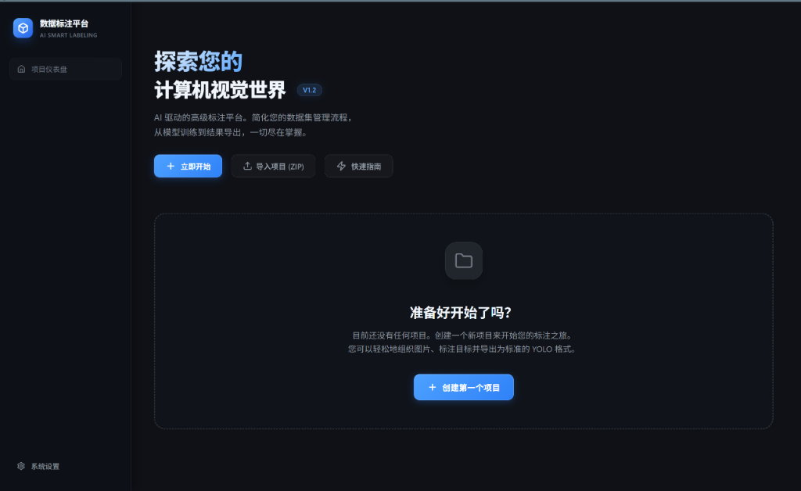
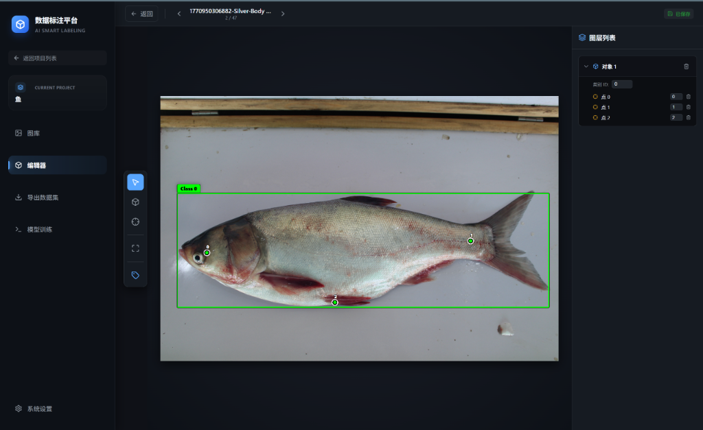
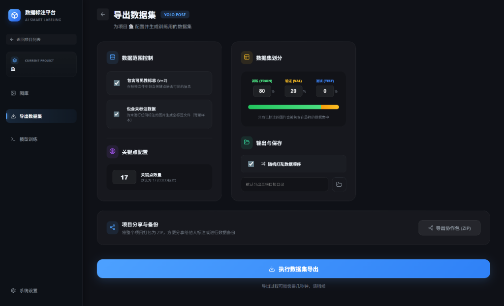

# 🤸‍♂️ Pose Annotator: 智能姿态与目标检测标注平台


**Pose Annotator** 是一个专为计算机视觉任务设计的现代、高性能标注工具。它结合了 Web 的灵活性与原生应用的强大性能，支持 **目标检测 (Bounding Box)** 和 **姿态估计 (Keypoint)** 两种标注模式，并深度集成了 YOLOv8 的数据格式导出与模型训练流程。

---

## ✨ 核心特性

### 🚀 极致性能
- **百万级图库支持**：后端集成 `sharp` 高性能图像处理引擎，支持实时生成缩略图，浏览海量数据集流畅无卡顿。
- **原生系统集成**：基于 Electron 构建，提供原生文件系统访问、目录选择器等桌面级体验。

### 🎯 专业标注体验
- **多模式标注**：支持矩形框 (BBox) 与 关键点 (Pose) 混合标注。
- **智能辅助**：
  - **十字辅助线**：像素级对齐。
  - **自动标签**：支持类别 ID 记忆与快速切换。
  - **自动保存**：所有操作实时保存至本地 JSON 文件，防止数据丢失。
- **现代化 UI**：采用 Glassmorphism（毛玻璃）设计风格，界面简洁直观，减少视觉疲劳。

### 📊 数据管理与导出
- **项目隔离**：支持多项目管理，数据相互独立。
- **高级导出**：
  - **YOLO 格式直出**：一键生成标准 YOLOv8 数据集结构 (`images`, `labels`, `data.yaml`)。
  - **数据集划分**：支持自定义 **Train/Val/Test** 比例（如 8:1:1）。
  - **随机打乱**：内置 Fisher-Yates 洗牌算法，确保数据集分布均匀。
  - **灵活配置**：支持导出是否包含不可见点 (Visibility Flag)，支持筛选仅已标注图片。

### 🤖 AI 模型训练集成
- **内置训练 UI**：无需编写代码，直接在界面配置 Epochs, Batch Size, Model 等参数。
- **实时监控**：训练日志实时回显，随时掌握训练进度（需配置 Python 环境）。
- **数据集预览**：训练前自动统计数据集分布，预览样本图片。

---

## � 界面预览

| 项目工作台 (Dashboard) | 标注编辑器 (Editor) |
| :---: | :---: |
|  |  |
| 现代化项目管理界面，支持 ZIP 持续协作。 | 强大的标注工具，支持垂直辅助线与实时保存。 |

| 数据集导出 (Dataset Export) |
| :---: |
|  |
| 独立的导出配置页面，支持 Train/Val/Test 自由划分。 |

---

## �🛠️ 环境准备

在开始之前，请确保您的环境满足以下要求：

*   **Node.js**: v16+ (推荐 v18 或更高)
*   **Python**: 3.8+ (仅使用训练功能时需要，需安装 `ultralytics` 库)

---

## 📦 安装指南

1.  **克隆或下载项目**
    ```bash
    git clone [repository-url]
    cd pose-annotator
    ```

2.  **安装依赖**
    项目采用前后端分离架构，需要分别安装依赖：

    ```bash
    # 1. 安装根目录依赖 (Electron & Backend)
    npm install

    # 2. 安装前端依赖 (React Client)
    cd client
    npm install
    cd ..
    ```

---

## 🚀 快速启动

我们提供了多种启动方式以适应不同的开发与使用场景：

### 方式 A：桌面客户端模式（推荐）
这是最完整的体验方式，在一个窗口中同时运行后端服务与前端界面。

```bash
npm run electron:dev
```
> **注意**：启动后会弹出一个 Electron 窗口，包含所有功能。

### 方式 B：打包构建（Windows）
如果您想生成可分发的 `.exe` 安装包：

```bash
npm run electron:build
```
构建产物将位于 `dist/` 目录下。

### 方式 C：Web 开发模式
如果您需要调试前端或后端代码：

1.  **启动后端** (http://localhost:5000)
    ```bash
    npm start
    ```
2.  **启动前端** (http://localhost:5173)
    ```bash
    npm run client:dev
    ```

---

## 📖 使用指南

### 1. 创建项目
启动应用后，点击首页的 **"New Project"** 卡片，输入项目名称（支持中文）。项目数据将存储在 `projects/` 目录下。
> **提示**：如果是旧版本用户，系统会自动将 `uploads/` 下的数据迁移至 `projects/Default_Project/`。

### 2. 导入图片
进入项目后，点击右上角的 **Upload** 按钮或直接拖拽图片到窗口中。支持 JPG, PNG, WEBP 等常见格式。

### 3. 进行标注
*   **切换模式**：在顶部工具栏切换 **BBox** (矩形框) 或 **Pose** (关键点) 模式。
*   **快捷键**：
    *   `Delete` / `Backspace`: 删除选中的标注。
    *   `W` / `A` / `S` / `D`: 微调选中框的位置（如有实现）。
*   **关键点逻辑**：关键点必须归属于某个矩形框。先画框，再在框内点选关键点。

### 4. 导出数据
点击 **Export** 按钮，打开导出配置面板：
*   **Path**: 选择导出目录（支持新建文件夹）。
*   **Split Ratio**: 设置训练集、验证集、测试集的比例。
*   **Keypoints**: 设置关键点数量（默认为 17，对应 COCO 格式）。

### 5. 模型训练 (Beta)
点击 **Train** 按钮，系统会检测 `export` 目录下的 `data.yaml`。
*   配置参数后点击 **Start Training**。
*   **依赖提示**：请确保宿主后的 Python 环境已安装 YOLOv8 (`pip install ultralytics`)，并且 `python` 命令可在终端直接调用。如果使用 Conda 环境，请在 `server.js` 中调整 Python 路径配置。

---

## 📂 目录结构

```text
pose-annotator/
├── client/                 # React 前端代码
│   ├── src/
│   │   ├── components/     # UI 组件 (Editor, Export, Training...)
│   │   └── ...
├── projects/               # [自动生成] 数据存储目录
│   └── MyProject/
│       ├── uploads/        # 原始图片
│       ├── annotations/    # JSON 标注文件
│       └── dataset/        # 导出的 YOLO 格式数据集
├── dist/                   # [自动生成] 构建产物
├── scripts/                # 辅助脚本 (train.py)
├── server.js               # Node.js 后端与 API
├── electron-main.js        # Electron 主进程入口
└── package.json            # 项目配置
```

---

## 📄 许可证

本项目采用 **ISC License** 许可证。
