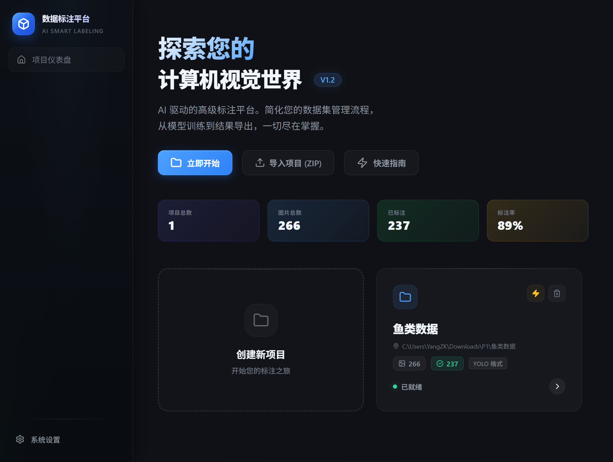
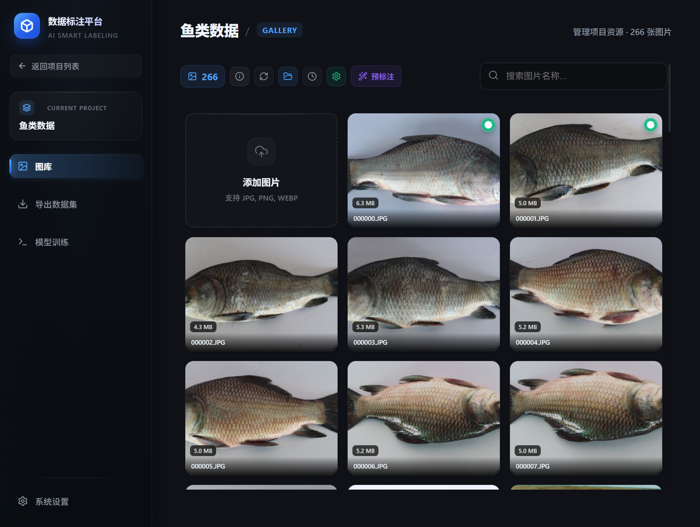
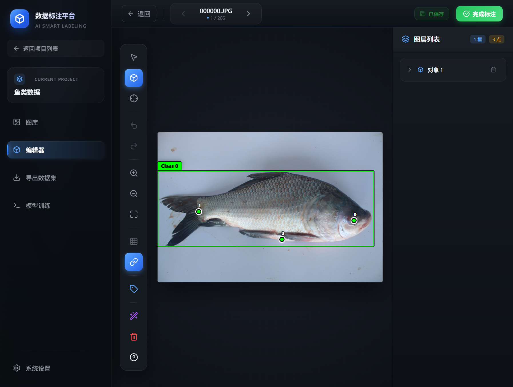
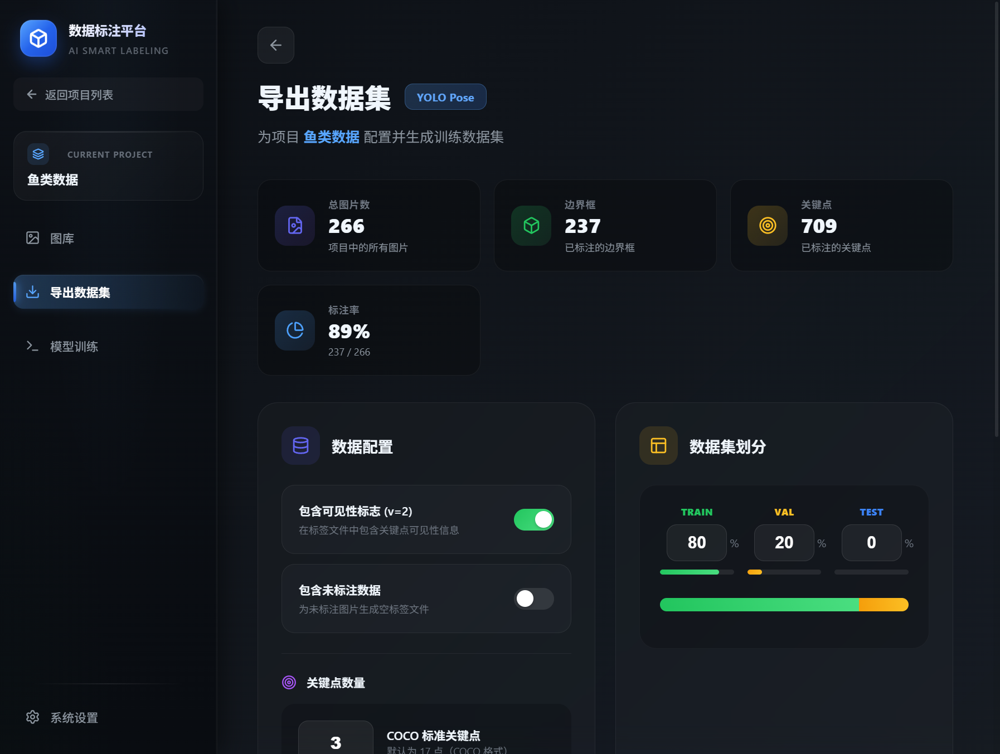
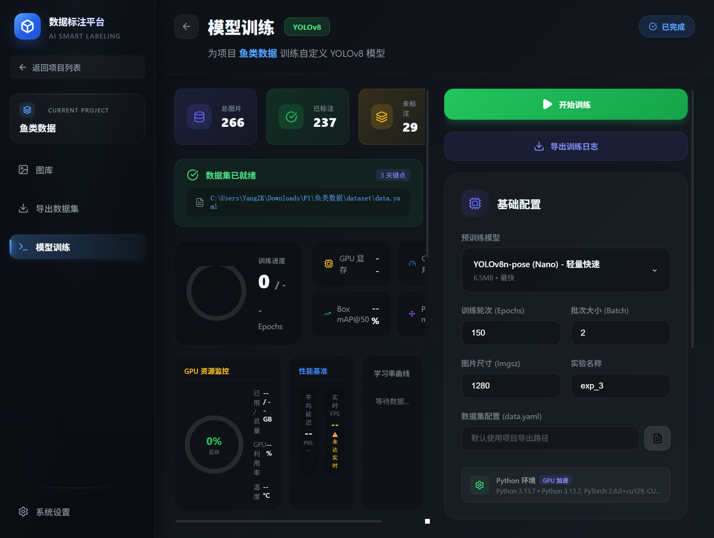
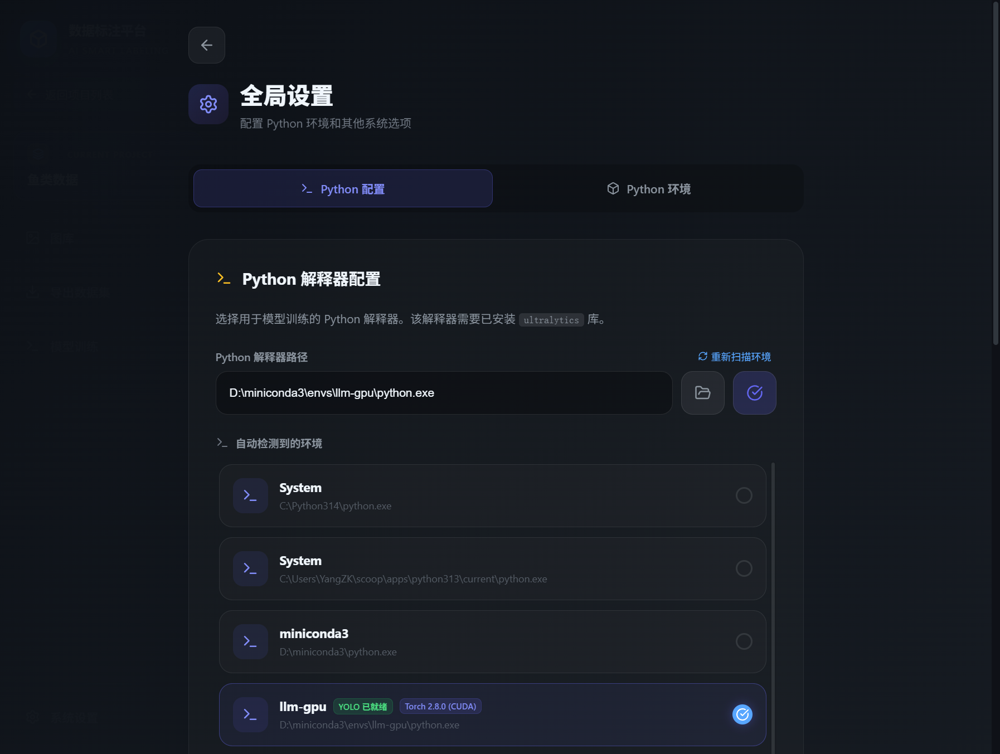

# Pose Annotator：目标检测与姿态关键点标注平台


Pose Annotator 是一个面向计算机视觉数据制作流程的桌面标注工具，覆盖从数据集管理、标注、导出到训练/预标注的闭环。

## 功能概览

- 标注模式：边界框（BBox）与关键点（Keypoints，可挂在某个 BBox 下）
- 数据管理：项目隔离、图库浏览、缩略图缓存、批量导入
- 自动保存：标注实时落盘到本地 JSON，降低数据丢失风险
- 数据导出：一键导出 YOLO Pose 数据集结构（images/labels/data.yaml）
- 训练/预测：可配置本机 Python 环境（ultralytics），在界面内启动训练/预标注（可选）

## 界面预览

| Dashboard | Gallery |
| :---: | :---: |
|  |  |

| Editor | Dataset Export |
| :---: | :---: |
|  |  |

| Training | Settings |
| :---: | :---: |
|  |  |

## 环境要求

- Node.js：v16+（推荐 v18 或更高）
- Python：3.8+（仅在使用训练/预测功能时需要）

## 安装

```bash
npm install
npm install --prefix client
```

## 运行方式

### 桌面端开发模式（推荐）

```bash
npm run electron:dev
```

### Web 开发模式（前后端分离）

```bash
npm start
```

另开一个终端：

```bash
npm run client:dev
```

默认：
- 后端：http://localhost:5000
- 前端：Vite 会优先使用 5173（占用会自动换端口）

### 打包构建（Electron）

```bash
npm run electron:build
```

构建产物位于 `dist/`，Windows 默认生成 NSIS 安装包（例如 `Pose Annotator Setup 1.3.4.exe`）。

## 配置

后端运行时配置位于 `server/settings.json`，常用字段：
- `projectsDir`：项目数据存放根目录（默认会在此目录下创建项目文件夹）
- `additionalProjectPaths`：额外扫描/创建项目的目录列表
- `pythonPath`：指定 Python 解释器路径（用于训练/预测）

## 使用流程

1. 创建项目：在 Dashboard 输入项目名创建项目
2. 导入图片：进入项目后上传/导入图片
3. 标注：先画 BBox，再添加该框对应的关键点
4. 导出：在“导出数据集”页面设置 Train/Val/Test 比例并导出
5. 训练/预测：配置 Python 环境后在“模型训练”页启动训练（可选）

## 数据与目录结构

项目数据会存放在 `projectsDir/<projectId>/` 下：

```text
<projectId>/
├── uploads/         原始图片
├── annotations/     每张图片对应一个 <image>.json
├── thumbnails/      缩略图缓存
└── dataset/         导出的 YOLO 数据集（images/labels/data.yaml）
```

## 标注文件格式（JSON）

每张图片对应一个 JSON 文件，例如 `annotations/000001.JPG.json`：

```json
[
  {
    "id": 1771242508799.3801,
    "type": "bbox",
    "x": 331.76,
    "y": 794.88,
    "width": 4567.35,
    "height": 1577.31,
    "label": "",
    "classIndex": 0
  },
  {
    "id": 1771242508799.9583,
    "type": "keypoint",
    "x": 391.43,
    "y": 1649.7,
    "label": "Keypoint",
    "keypointIndex": 0,
    "parentId": 1771242508799.3801
  }
]
```

约束：
- `type: "keypoint"` 必须通过 `parentId` 关联到某个 `type: "bbox"`。

## YOLO Pose 标签格式

导出的标签行格式：

```text
<class_id> <cx> <cy> <w> <h> <kp1_x> <kp1_y> <kp1_v> <kp2_x> <kp2_y> <kp2_v> ...
```

对应的 `data.yaml` 会包含 `kpt_shape` 等配置。

## 常见问题

### 1) 删除项目失败（EBUSY / 文件被占用）

Windows 下删除目录会先尝试“重命名后后台清理”。如果目录被占用，重命名也会失败，表现为 `EBUSY: resource busy or locked`。

处理建议：
- 关闭正在打开的图片/标注文件（包括资源管理器预览窗格）
- 停止正在运行的训练/预测任务
- 退出应用并重启后再删除

### 2) 端口冲突

- 后端默认 5000；被占用时请先释放端口或修改配置
- 前端 5173 被占用时 Vite 会自动尝试下一个端口

### 3) 训练/预测不可用

确认：
- `server/settings.json` 里的 `pythonPath` 指向有效解释器
- Python 环境已安装 `ultralytics`（以及训练所需依赖）

## 目录结构（源码）

```text
pose-annotator/
├── client/              前端（React + Vite）
├── server/              后端（Express，模块化实现）
├── scripts/             训练/预测相关脚本
├── docs/                文档与截图
├── electron-main.js     Electron 主进程
└── server.js            旧版后端（仅作为兼容回退）
```

## License

ISC License
